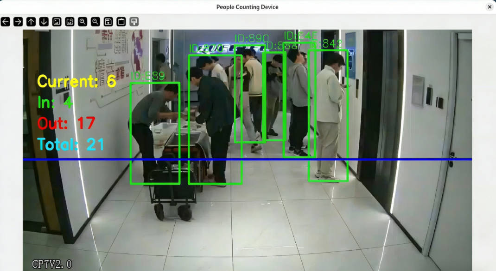

# 人流量统计设备

[中文]| [English](README.md)

## 🎯 项目概述

本项目是一个运行在Quectel Pi H1智能主控板下的轻量级人流量统计设备，集成了目标检测、目标跟踪和行人重识别（ReID）技术，能够：

- 实时检测视频流中的人体目标
- 使用ByteTrack算法进行稳定的目标跟踪
- 基于ReID特征进行人员去重统计
- 支持USB摄像头、IP摄像头、本地视频文件
- 提供实时人数统计、累计去重人数统计和进出方向统计




## ✨ 主要特性

### 核心功能
- **多源输入支持**：USB摄像头、ONVIF IP摄像头、本地视频文件
- **实时目标检测**：基于YOLOv5n ONNX模型，支持多种输入尺寸（320/416/640）
- **稳定目标跟踪**：集成ByteTrack算法，有效处理遮挡和目标丢失场景
- **智能人员统计**：
  - 实时人数统计（当前帧内的人数）
  - 累计去重人数统计（基于track_id的历史累计人数）
  - 进出方向统计（基于虚拟线的流向分析）
- **ReID增强**：可选启用OSNet ReID模型，提升跟踪稳定性


## 🏗️ 项目架构

```
人流量统计设备
├── 项目根目录
│   ├── README.md                 # 项目文档
│   ├── README_zh.md              # 中文文档  
│   ├── requirements.txt          # Python依赖
│   ├── asset/                    # 示例素材和测试视频
│   └── src/                      # 源代码目录
│       ├── usb_camera_main.py    # USB摄像头入口点
│       ├── ip_camera_main.py     # IP摄像头入口点  
│       ├── local_video_main.py   # 本地视频文件入口点
│       ├── bytetrack.py          # ByteTrack目标跟踪实现
│       ├── line_counter.py       # 虚拟线计数逻辑
│       └── reid_extractor.py     # OSNet ReID特征提取
```

## 🔧 安装依赖

### 克隆代码
```bash
git clone https://github.com/Quectel-Pi/demo-people-counting-device.git
cd demo-people-counting-device/
```

### Python依赖
```bash
# 安装项目依赖
pip3 install -r requirements.txt
```

## 🤖 模型准备

### 目标检测模型
项目支持以下YOLOv5n ONNX模型（位于 `src/` 目录）：

| 模型文件 | 输入尺寸 | 特点 |
|---------|---------|------|
| `yolov5n_320.onnx` | 320×320 | 速度最快，精度稍低（默认）|
| `yolov5n_416.onnx` | 416×416 | 速度与精度平衡|
| `yolov5n_640.onnx` | 640×640 | 精度最高，速度较慢 |

> **注意**：所有模型文件已包含在项目中，位于 `src/` 目录下，无需额外下载。

### 行人重识别模型
- **ReID模型**：`osnet_x0_25_market1501.onnx`（位于 `src/` 目录）
- **输入尺寸**：256×128（宽×高）
- **特征维度**：512维归一化特征向量

> **注意**：ReID模型需要从Market1501等ReID数据集微调后的版本，不能直接使用ImageNet预训练模型。

## 🚀 使用方法

### USB摄像头模式

```bash
cd ~/demo-people-counting-device/src
python3 usb_camera_main.py
```

### IP摄像头模式

```bash
cd ~/demo-people-counting-device/src  
python3 ip_camera_main.py
```

### 本地视频文件测试

```bash
cd ~/demo-people-counting-device/src
python3 local_video_main.py --video ../asset/street.mp4
```

**命令行参数：**
- `--video`: 指定视频文件路径（必填）
- `--model`: 指定YOLO模型路径（可选，默认使用 `yolov5n_320.onnx`）

**示例：**
```bash
# 使用默认模型处理视频
python3 local_video_main.py --video test_video.mp4

# 指定高精度模型
python3 local_video_main.py --video test_video.mp4 --model yolov5n_640.onnx
```

## 📝 统计逻辑说明

### 三种计数类型
1. **实时计数（Current Count）**：当前帧检测到的活跃人数
2. **累计计数（Total Count）**：基于track_id的历史累计去重人数
3. **进出计数（In/Out Count）**：基于虚拟线的进出方向统计

### 计数原理
- **实时计数**：直接统计当前帧中活跃的track数量
- **累计计数**：每个新出现的track_id都会增加累计计数，track_id由ByteTrack算法分配，具有唯一性
- **进出计数**：通过虚拟线（默认画面中间水平线）检测目标跨越方向：
  - 向下移动（y坐标增大）：计入"In"
  - 向上移动（y坐标减小）：计入"Out"
  - 使用目标中心点的历史轨迹判断穿越方向
  - 每个track_id只会被计数一次，防止重复统计

### 虚拟线自定义
当前版本使用默认中间线，支持自定义虚拟线位置和方向：
- **水平线**：`direction='horizontal'`，`line_position=指定Y坐标`
- **垂直线**：`direction='vertical'`，`line_position=指定X坐标`

## ❓ 常见问题

### Q1: 摄像头无法打开

**解决方案：**

- 将当前用户添加到 video 用户组：`sudo usermod -aG video $USER`
- 重启系统使用户组权限生效
- 检查摄像头是否被其他进程占用

### Q2: 模型文件加载失败

**解决方案：**
- 确保在 `src/` 目录下运行脚本（所有模型文件均位于此目录）
- 不要更改工作目录，直接在 `src/` 目录执行启动命令

### Q3: IP 摄像头连接失败

**解决方案：**

- 测试网络连通性：`ping <摄像头IP地址>`
- 确认摄像头 ONVIF 服务已启用

### Q4: 系统性能卡顿

**解决方案：**

- 关闭 ReID 功能（在代码中设置 `use_reid=False`）
- 降低显示窗口分辨率

## 报告问题
如在使用过程中遇到问题，欢迎在[移远官方论坛](https://forumschinese.quectel.com/c/quectel-pi/58) 提交技术咨询，我们的技术支持团队将及时为您解答。
欢迎提交 Issue 反馈问题或 Pull Request 贡献代码改进！